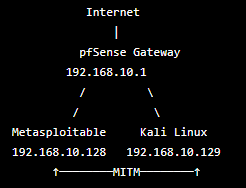
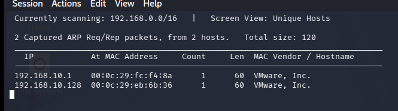
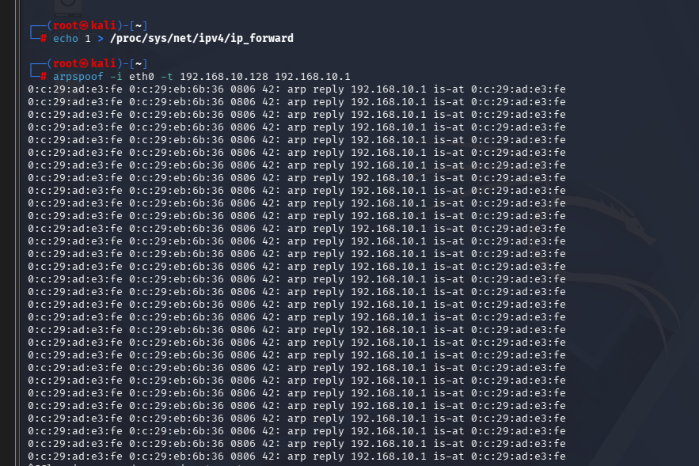
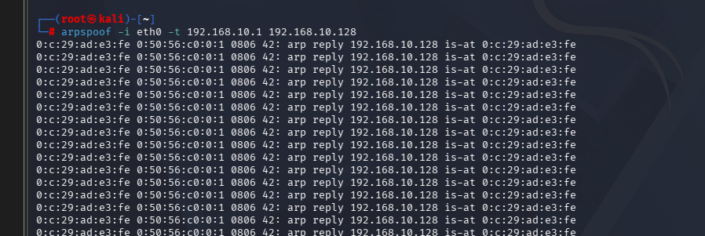
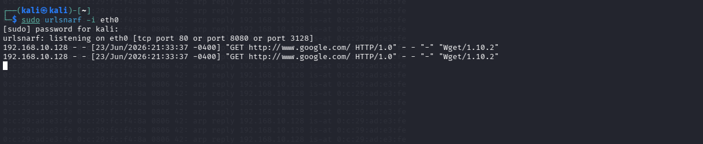

# ARP Spoofing (Man-in-the-Middle) Lab

## Overview

Performed a controlled ARP spoofing (Man-in-the-Middle) attack within an isolated home lab environment to demonstrate how Address Resolution Protocol (ARP) poisoning can intercept unencrypted network traffic. The exercise validated packet forwarding, bidirectional ARP poisoning, and HTTP traffic capture between a victim host and the network gateway.

---

## Objectives

* Understand ARP spoofing fundamentals.
* Perform a Man-in-the-Middle (MITM) attack.
* Capture unencrypted HTTP traffic.
* Demonstrate the importance of encrypted communications.

---

## Lab Environment

### Attacker

* Kali Linux
* 192.168.10.129

### Victim

* Metasploitable
* 192.168.10.128

### Gateway

* pfSense
* 192.168.10.1

### Network Topolgy



---

## Tools Used

* Kali Linux
* dsniff
* arpspoof
* urlsnarf
* netdiscover
* pfSense

---

## Methodology

### 1. Host Discovery

Enumerated active systems using `netdiscover` to identify the gateway and victim.




### 2. Packet Forwarding

Enabled IPv4 forwarding on the Kali attacker system to allow packets to pass through the attacking host.

### 3. ARP Poisoning

Performed bidirectional ARP poisoning by simultaneously poisoning:

* Victim → Gateway
* Gateway → Victim

#### Victim Poisoning



#### Gateway Poisoning




This redirected network traffic through the attacking host.

### 4. Traffic Capture

Captured HTTP requests using `urlsnarf` while the victim generated web traffic.



### 5. Validation

Generated HTTP traffic from the victim using `wget`, successfully validating that the request traversed the attacker.

---

## Results

The attack successfully intercepted the following HTTP request:

```text
192.168.10.128 GET http://www.google.com/ HTTP/1.0 "Wget/1.10.2"
```

The captured request confirmed that unencrypted web traffic was visible to an attacker positioned as a Man-in-the-Middle.

---

## Skills Demonstrated

* Network Enumeration
* Layer 2 Networking
* ARP Poisoning
* Man-in-the-Middle Attacks
* Traffic Analysis
* Linux Administration
* Network Security Fundamentals

---

## Lessons Learned

* Successful MITM attacks require bidirectional ARP poisoning.
* IP forwarding must be enabled to maintain communication between the victim and gateway.
* HTTP traffic can be observed in plaintext during interception.
* HTTPS protects confidentiality by encrypting transmitted data, preventing attackers from viewing web content even when positioned as a Man-in-the-Middle.
