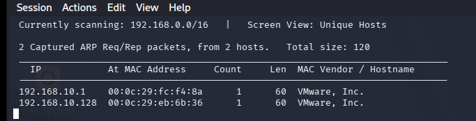
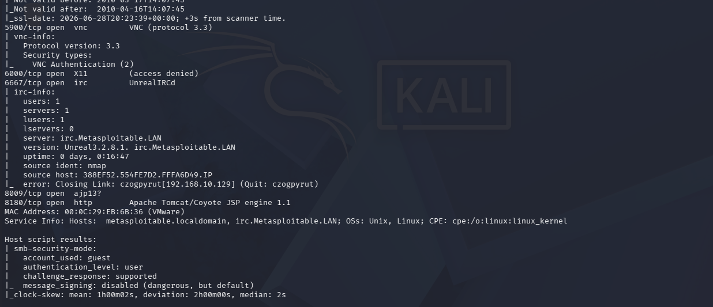
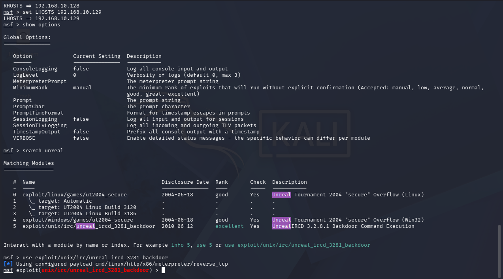
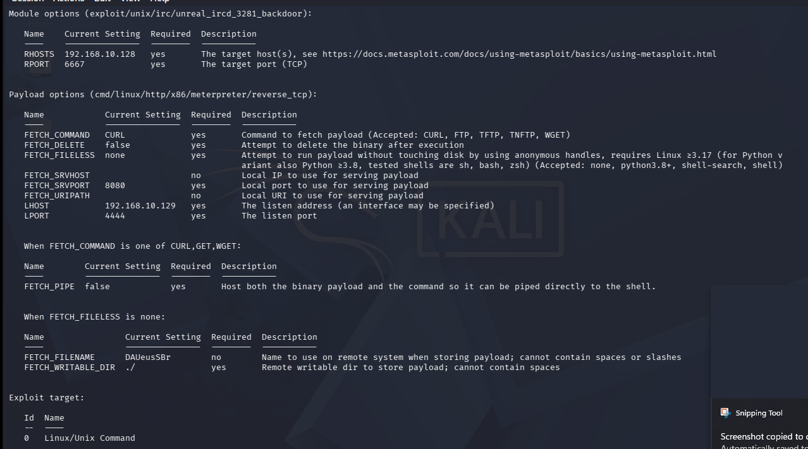
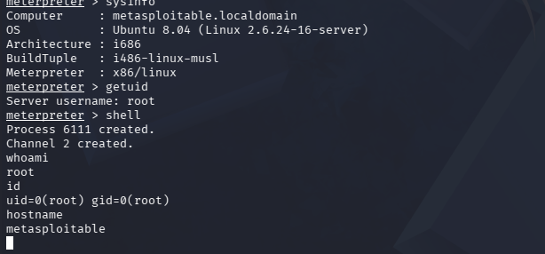

# UnrealIRCd Backdoor Exploitation

## Overview

The objective of this lab was to exploit the known UnrealIRCd 3.2.8.1 backdoor vulnerability running on TCP port 6667 in order to obtain remote shell access within a controlled home lab environment. 

---

## Objectives

- Enumerate the target system.
- Identify exposed network services.
- Configure the exploit module.
- Execute the exploit.
- Validate successful remote access.

---

## Lab Environment

### Attacker

- Kali
- 192.168.10.129

### Target

- Metasploitable
- 192.168.10.128

### Gateway

- pfSense
- 192.168.10.1

---

## Network Topology

---

## Tools Used

- Kali Linux
- netdiscover
- Nmap
- msfconsole

---

## Lab Walkthrough

### 1. Enumeration

Host discovery was performed to identify active systems within the isolated lab environment. Netdiscover identified the Metasploitable target and pfSense gateway, confirming network connectivity prior to service enumeration.

Service enumeration identified multiple exposed network services. Particular attention was given to the UnrealIRCd service, which matched a publicly documented vulnerability suitable for validation within the controlled lab environment.

---

### 2. Exploitation

Launched the Metasploit Framework and selected the UnrealIRCd 3.2.8.1 backdoor exploit module.

Configured the exploit by specifying the attacker (LHOST) and target (RHOSTS) addresses prior to execution.

---

### 3. Validation

Successfully exploited the target system, established a Meterpreter session, and verified root-level access by launching an interactive Linux shell.

---

## Results

The UnrealIRCd 3.2.8.1 backdoor vulnerability was successfully exploited using the Metasploit Framework. The exploit established a Meterpreter session with root privileges on the target system. An interactive Linux shell was launched to validate operating system access, confirm command execution, and verify administrative privileges.

---

## Conclusion

This lab successfully demonstrated the complete penetration testing workflow from host discovery and service enumeration through exploitation and post-exploitation validation. The exercise reinforced the importance of systematic reconnaissance, proper exploit configuration, and thorough verification of successful access.

---

## Skills Demonstrated

- Network Enumeration
- Service Enumeration
- Vulnerability Identification
- Metasploit Framework
- Linux Command Line
- Meterpreter
- Post-Exploitation Validation

---

## Lessons Learned

- Thorough enumeration is essential before selecting an exploit.
- Proper configuration of Metasploit modules is required for successful exploitation.
- Meterpreter provides advanced post-exploitation capabilities beyond a standard command shell.
- Validation should confirm not only shell access but also privilege level and target identity.