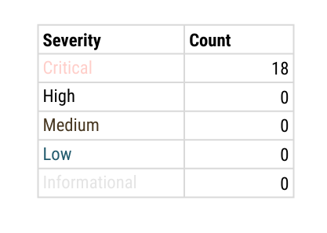
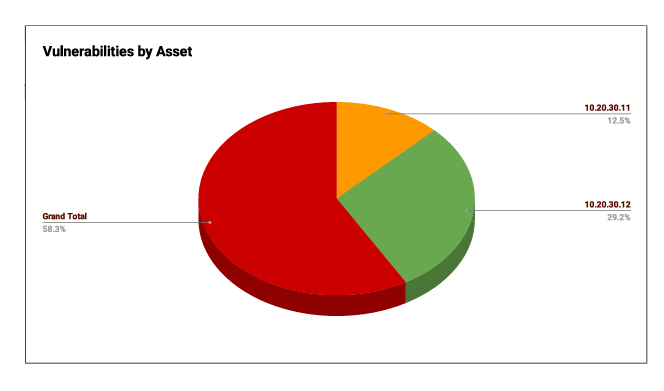
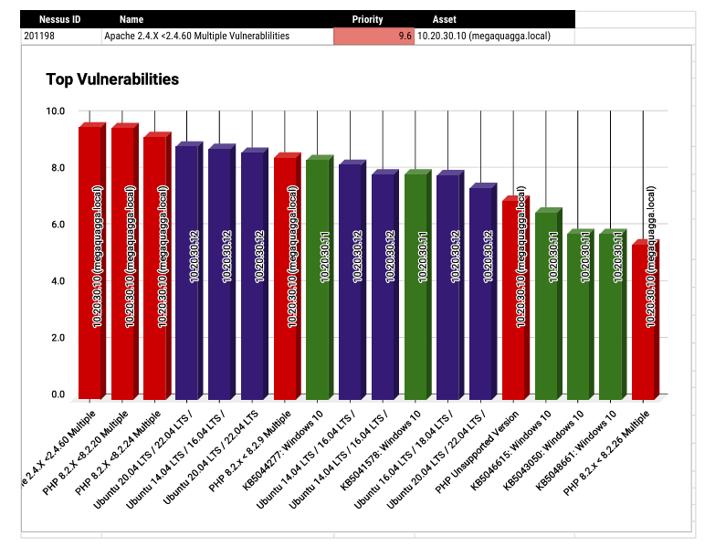

# Enterprise Vulnerability Assessment using Nessus

## Overview

Performed a comprehensive vulnerability assessment of a simulated enterprise network using Nessus Essentials. The engagement focused on identifying security weaknesses, prioritizing remediation efforts, and communicating technical findings to both technical teams and executive stakeholders.

## Objectives

- Perform authenticated vulnerability scanning
- Analyze discovered vulnerabilities
- Prioritize remediation using CVSS and business risk
- Develop executive-level reporting
- Produce actionable remediation recommendations

## Environment

- Nessus Essentials
- Windows Server 2019
- Ubuntu Linux
- Apache Web Server
- PHP
- Microsoft Office

## Assessment Summary

The assessment identified **18 critical vulnerabilities** across three systems. The findings included outdated Apache and PHP installations, unsupported software versions, Windows Server security updates, and multiple Ubuntu package vulnerabilities requiring remediation. :contentReference[oaicite:0]{index=0}

## Remediation Priorities

1. Patch Apache and PHP on the web server.
2. Update vulnerable Ubuntu packages.
3. Apply outstanding Windows Server security updates.

## Deliverables

- Executive Summary
- Technical Vulnerability Assessment
- Remediation Plan
- Nessus Scan Reports
- Risk Prioritization Charts

## Skills Demonstrated

- Vulnerability Assessment
- Vulnerability Management
- Nessus
- CVSS Analysis
- Risk Prioritization
- Technical Documentation
- Executive Reporting
- Patch Management

## Key Results

- Identified 18 critical vulnerabilities
- Prioritized remediation across three assets
- Produced executive and technical reports
- Developed remediation roadmap

- ## Visual Summary

### Severity Distribution

### Vulnerabilities by Asset

### Top Vulnerabilities

